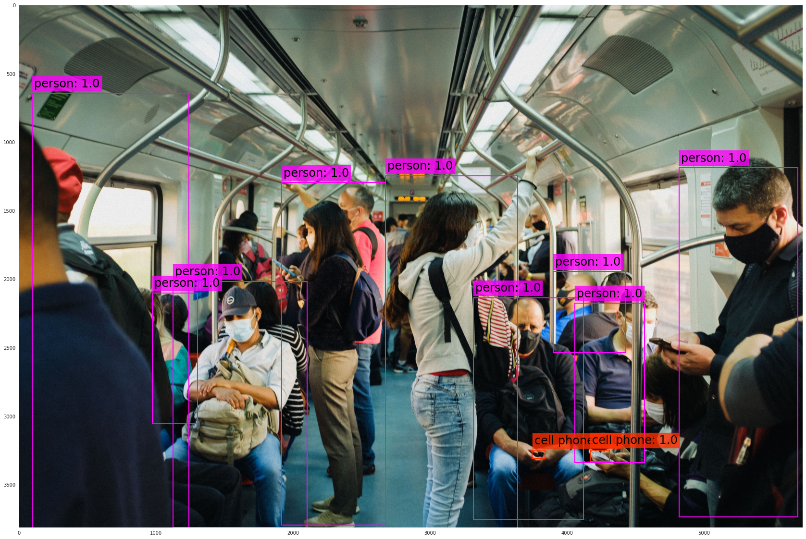

# FIAP MBA em Machine Learning e Inteligência Artificial

Informações sobre o curso acesse [aqui](https://www.fiap.com.br/mba/mba-em-artificial-intelligence-e-machine-learning/).



Este repositório reúne todos os notebooks, imagens, modelos e demais materiais necessário para a condução das aulas e revisão das mesmas.

Utilize as [discussões](https://github.com/michelpf/fiap-ml-visao-computacional/discussions) ou mesmo crie [issues](https://github.com/michelpf/fiap-ml-visao-computacional/issues) se precisar de alguma informação.

Como é um repositório público, aceito eventuais Pull Requests!

## Visão Computacional

Nas aulas podemos utilizar o Google Colab, os Notebooks do Kaggle ou a própria distribuição local Anaconda, com uso do Jupyter Notebook, que há vem instalado nesta distribuição. Você também pode usar até mesmo o VSCode, escolha o ambiente que mais adeque ao seu estilo!

Para instalar o Anaconda, acesse a sessão de [Downloads](https://www.anaconda.com/download) do Anaconda.

Tanto o [Google Colab](https://colab.research.google.com/) ou [Kaggle](https://www.kaggle.com/) podem ser acessados diretamente dos respectivos sites.

Para quem for usar Colab ou Kaggle, use o _badge_ de cada um. Eles possuem um link que já abre direto em cada plataforma, levando em consideração as particularidades de cada ambiente.

## Uso de câmeras

Em algumas aulas poderá ser utilizado o _streaming_ de vídeo de câmeras, que somente funciona em instalações locais. Tanto Google Colab quanto Kaggle ainda não suportam câmeras no modo ao vivo (exceto Colab que suporte imagens estáticas) por serem ambientes virtualizados.

Veja [esta](https://github.com/michelpf/fiap-ml-tec-proc-imagens/blob/master/util/videos-camera-mac-windows.ipynb) rápida introdução do uso de câmeras com o OpenCV em MacOS e Windows. Guarde esse pequeno guia para futuros usos, pois no MacOS as coisas funcionam um pouco diferente do Windows e costumam travar 😕 .

### Pacotes utilizados

* [OpenCV](https://opencv.org/) 3.4.3 (```conda install -c conda-forge opencv==3.4.3```)
* [Keras](https://keras.io/) 2.3.1 (```conda install keras==2.3.1```)
* [Matplotlib](https://matplotlib.org/) 3.1.3 (```conda install matplotlib==3.1.3```)
* [Seaborn](https://seaborn.pydata.org/) 0.0.10 (```conda install -c conda-forge seaborn==0.10.0```)
* [Imutils](https://pypi.org/project/imutils/) 0.5.3 (```conda install -c conda-forge imutils==0.5.3```)
* [Scikit Learn](https://scikit-learn.org/stable/) 0.22.1 (```conda install scikit-learn==0.22.1```)
* [Scipy](https://www.scipy.org/) 1.4.1 (```conda install scipy==1.4.1```)

_No Google Colab todas as dependências já estão instaladas. Já no Kaggle está indicando como instalar as dependências, sem dificuldades._ 😄

Aulas no programa atualizado da disciplina:

## Introdução a visão computacional (Aula 1)

### Introdução sobre visão computacional e processamento de imagens

1. Introdução do OpenCV
2. Instalação
3. Formação de imagens
4. Representação de cores
5. Histograma
6. Construção de imagens

[](https://colab.research.google.com/github/michelpf/fiap-ml-visao-computacional/blob/master/aula-1-introducao-visao-computacional/introducao-visao-computacional.ipynb) 

### Desafio

1. Identificação de cores 
[](https://colab.research.google.com/github/michelpf/fiap-ml-visao-computacional/blob/master/aula-1-introducao-visao-computacional/desafio-1/desafio-1.ipynb)

    Solução [](https://colab.research.google.com/github/michelpf/fiap-ml-visao-computacional/blob/master/aula-1-introducao-visao-computacional/desafio-1/desafio-1-solucao.ipynb) 


## Manipulação de imagens (Aula 2)

### Manipulação e transformação de imagens

1. Transformações
2. Translações
3. Rotações
4. Resizing
5. Cropping
6. Masking
7. Suavização

[](https://colab.research.google.com/github/michelpf/fiap-ml-visao-computacional/blob/master/aula-2-transformacao/transformacao-imagens.ipynb)

### Desafios

1. Transformação de imagens [](https://colab.research.google.com/github/michelpf/fiap-ml-visao-computacional/blob/master/aula-2-transformacao/desafio-1/desafio-1.ipynb) 

    Solução
[](https://colab.research.google.com/github/michelpf/fiap-ml-visao-computacional/blob/master/aula-2-transformacao/desafio-1/desafio-1-solucao.ipynb)

2. Máscaras em imagens [](https://colab.research.google.com/github/michelpf/fiap-ml-visao-computacional/blob/master/aula-2-transformacao/desafio-2/desafio-2.ipynb)

    Solução
    [](https://colab.research.google.com/github/michelpf/fiap-ml-visao-computacional/blob/master/aula-2-transformacao/desafio-2/desafio-2-solucao.ipynb)

3. Pipeline machine learning [](https://colab.research.google.com/github/michelpf/fiap-ml-visao-computacional/blob/master/aula-2-transformacao/desafio-3/desafio-3.ipynb)

    Solução [](https://colab.research.google.com/github/michelpf/fiap-ml-visao-computacional/blob/master/aula-2-transformacao/desafio-3/desafio-3-solucao.ipynb)


## Segmentação de imagens (Aula 3)

### Técnicas para segmentar e extrair artefatos e regiões de interesse de imagens

1. Suavização
2. Binarização
3. Dilatação e Erosão
4. Deteção de Borda
4. Contornos
5. Identificação de Formas

[](https://colab.research.google.com/github/michelpf/fiap-ml-visao-computacional/blob/master/aula-3-segmentacao/segmentacao.ipynb)

### Desafios

1. Contornos em imagens [](https://colab.research.google.com/github/michelpf/fiap-ml-visao-computacional/blob/master/aula-3-segmentacao/desafio-1/desafio-1.ipynb)

    Solução [](https://colab.research.google.com/github/michelpf/fiap-ml-visao-computacional/blob/master/aula-3-segmentacao/desafio-1/desafio-1-solucao.ipynb)

2. Limpeza de imagens [](https://colab.research.google.com/github/michelpf/fiap-ml-visao-computacional/blob/master/aula-3-segmentacao/desafio-2/desafio-2.ipynb)

    Solução [](https://colab.research.google.com/github/michelpf/fiap-ml-visao-computacional/blob/master/aula-3-segmentacao/desafio-2/desafio-2-solucao.ipynb)


## Classificação de objetos e análise facial (Aula 4)

### Classificadores de objetos e análise facial

1. Classificadores em cascata de Haar
2. Classificador de marcos faciais DLib
3. Análise Facial
4. Alinhamento de faces

[](https://colab.research.google.com/github/michelpf/fiap-ml-visao-computacional/blob/master/aula-4-classificacao-objetos-analise-facial/classificacao-objetos-analise-facial.ipynb)

### Desafios

1. Detecção de sorriso [](https://colab.research.google.com/github/michelpf/fiap-ml-visao-computacional/blob/master/aula-4-classificacao-objetos-analise-facial/desafio-1/desafio-1.ipynb)
    
    Solução [](https://colab.research.google.com/github/michelpf/fiap-ml-visao-computacional/blob/master/aula-4-classificacao-objetos-analise-facial/desafio-1/desafio-1-solucao.ipynb)

2. Classificação de emoções com marcos faciais [](https://colab.research.google.com/github/michelpf/fiap-ml-visao-computacional/blob/master/aula-4-classificacao-objetos-analise-facial/desafio-2/desafio-2.ipynb)

    Solução [](https://colab.research.google.com/github/michelpf/fiap-ml-visao-computacional/blob/master/aula-4-classificacao-objetos-analise-facial/desafio-2/desafio-2-solucao.ipynb)


## Machine learning, deep learning e transfer learning aplicado a imagens (Aula 5)

### Reconhecimento de imagens e objetos

1. Reconhecimento de imagens utilizando redes neurais profundas
2. Técnicas de transferência de aprendizado (*transfer learning*)
3. Reconhecimento de objetos com YOLO (You Only See Once).

[](https://colab.research.google.com/github/michelpf/fiap-ml-visao-computacional/blob/master/aula-5-machine-learning-aplicado/reconhecimento-facial-deep-learning.ipynb)

### Desafio

1. Reconhecimento de faces [](https://colab.research.google.com/github/michelpf/fiap-ml-visao-computacional/blob/master/aula-5-machine-learning-aplicado/desafio-1/desafio-1.ipynb)
    
    Solução [](https://colab.research.google.com/github/michelpf/fiap-ml-visao-computacional/blob/master/aula-5-machine-learning-aplicado/desafio-1/desafio-1-solucao.ipynb)


## Capstones

Projetos de conclusão da disciplina aplicados.

1. [Análise de Imagens Médicas](https://github.com/michelpf/fiap-ml-visao-computacional-analise-imagens-medicas)
2. [Auditoria de Vídeo](https://github.com/michelpf/fiap-ml-visao-computacional-auditoria-video)
3. [Detector de Liveness](https://github.com/michelpf/fiap-ml-visao-computacional-detector-liveness)